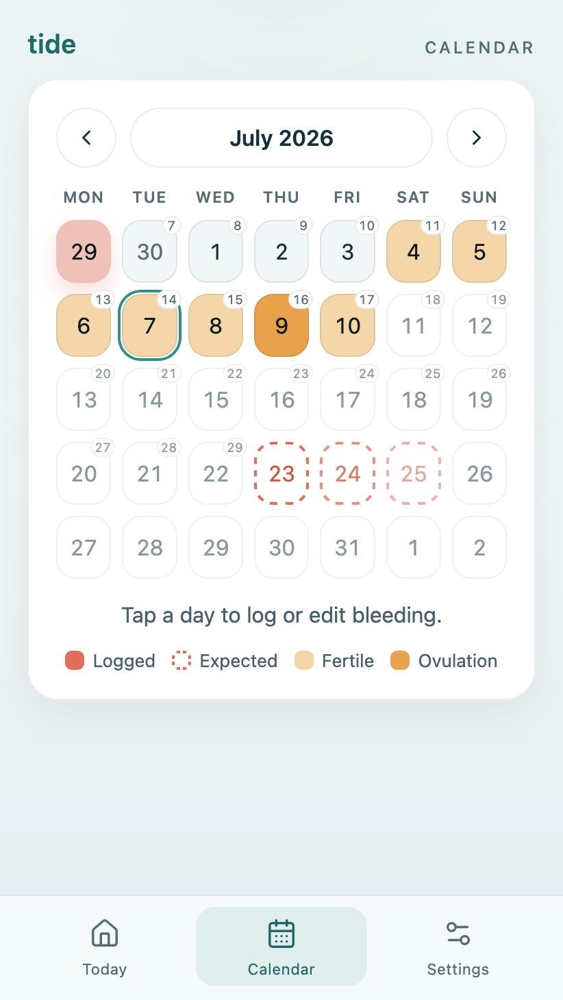

# Tide

[](https://github.com/simonvanlierde/tide/actions/workflows/ci.yml)
[](https://codecov.io/gh/simonvanlierde/tide)
[](https://tide.duinlab.nl)
[](LICENSE)
[](https://tide.duinlab.nl)

Tide is a privacy-first period tracker — a small, local-first React PWA that keeps all cycle data in your browser.

| Today | Calendar |
| --- | --- |
| <picture><source media="(prefers-color-scheme: dark)" srcset="docs/screenshots/today-dark.png"></picture> | <picture><source media="(prefers-color-scheme: dark)" srcset="docs/screenshots/calendar-dark.png"></picture> |

## Install

Tide runs in the browser and installs as an app — no app store needed.

1. Open **[tide.duinlab.nl](https://tide.duinlab.nl)**.
2. Add it to your home screen:
   - **iOS (Safari):** Share → *Add to Home Screen*
   - **Android (Chrome):** menu (⋮) → *Install app*
   - **Desktop (Chrome/Edge):** install icon in the address bar

Once installed it works offline, and all data stays on your device.

## Features

- **Log bleeding days**: add or remove with one tap
- **Today at a glance**: a tidal cycle dial showing your current day and phase (menstrual / follicular / ovulation / luteal) and a scrub preview
- **Predictions**: next period learned from your history (28-day fallback), plus an approximate fertile window and ovulation estimate
- **Log reminders**: a one-tap prompt in the days around your predicted period
- **Calendar**: month-by-month view with per-day period numbers and ovulation / next-period markers, for reviewing and logging days
- **Private by design**: installable, offline-capable PWA; all data stays on the device; no accounts, no network, no analytics

### How predictions work

Every estimate is computed on-device from the bleeding days you log. Nothing leaves your device.

- **Cycles.** A gap of **10+ days** between logged bleeding days starts a new cycle; shorter gaps are missed logs within the same period.
- **Cycle length.** The **median of your last 6 completed cycles** (days between starts). Median so one odd cycle doesn't skew it; recent cycles only, since cycle length drifts. Falls back to **28 days** until you've logged two cycles.
- **Period length.** Average of past periods, clamped to the **2–7 day** normal band (ACOG). Ignores the current, unfinished period; defaults to **4 days** with no history.
- **Next period.** Most recent cycle start plus the estimated cycle length.
- **Ovulation.** **14 days before** the next predicted period — the luteal phase is the cycle's least variable part. Calendar math can't do better without temperature or LH-test input, which Tide doesn't collect.
- **Fertile window.** The 5 days before through 1 day after ovulation (sperm survive ~5 days, the egg ~1). It **widens with the standard deviation of your recent cycles** (capped at ±5 days): tight for regular cycles, wider for irregular ones.

Estimates are informational, not a form of birth control.

## Roadmap

- Next up: insights and stats
- Improved onboarding UI / UX
- Multi-language support

## Development

Requires Node 26 and pnpm 11.

```bash
pnpm install
pnpm dev
```

| Command | Description |
| --- | --- |
| `pnpm check` | Typecheck, lint, tests, build, and bundle-size budget — the CI gate |
| `pnpm test` | Unit and UI tests |
| `pnpm test:e2e` | Playwright smoke tests |
| `pnpm build` | Production build to `dist/` |

### Deployment

**[tide.duinlab.nl](https://tide.duinlab.nl)** is hosted on Cloudflare Pages via its Git
integration: a push to `main` triggers a build (`pnpm build`) that publishes `dist/`. The build
command and preview settings live in the Cloudflare dashboard; the repo only pins the output
directory in [`wrangler.jsonc`](wrangler.jsonc).

To deploy from a local checkout: `pnpm deploy` (`wrangler pages deploy`).

### Accessibility

Two automated checks run in CI:

- **Static lint:** Biome's `a11y` rules (`biome.json`) run as part of `pnpm lint` / `pnpm check`.
- **Runtime axe checks:** `tests/e2e/a11y.spec.ts` runs [axe-core](https://github.com/dequelabs/axe-core) against `/`, `/history`, and `/settings`;  both themes, with overlays open, tagged `wcag2a`/`wcag2aa`, failing on any *moderate*+ violation. Run with `pnpm test:e2e`.

## Architecture

Cycle logic is kept pure and isolated from React and the browser, so it can be tested as plain functions. Dependencies point inward — the React layer reads through `state`, which is the only caller of the pure `domain` and the `data` persistence boundary:

- `src/domain` — pure cycle and reminder logic (no React, storage, or browser APIs)
- `src/data` — defaults, validation, and normalization at the `localStorage` boundary
- `src/state` — reducer and selectors, separate from the React provider
- `src/app` — app shell and pathname-based routing (`/`, `/history`, `/settings`)
- `src/features` — screen components and presentation helpers
- `src/ui` — reusable UI primitives
- `src/styles` — design tokens and shared styling
- `src/utils` — shared date helpers

Tests mirror this layering, with a thin Playwright e2e layer covering routing, persistence across reloads, and PWA smoke.

The core design decision — keeping all data on-device with no backend — is recorded in [docs/adr/0001-local-first-no-backend.md](docs/adr/0001-local-first-no-backend.md). Releases are tracked in [CHANGELOG.md](CHANGELOG.md).

## License

[MIT](LICENSE) © Simon van Lierde
