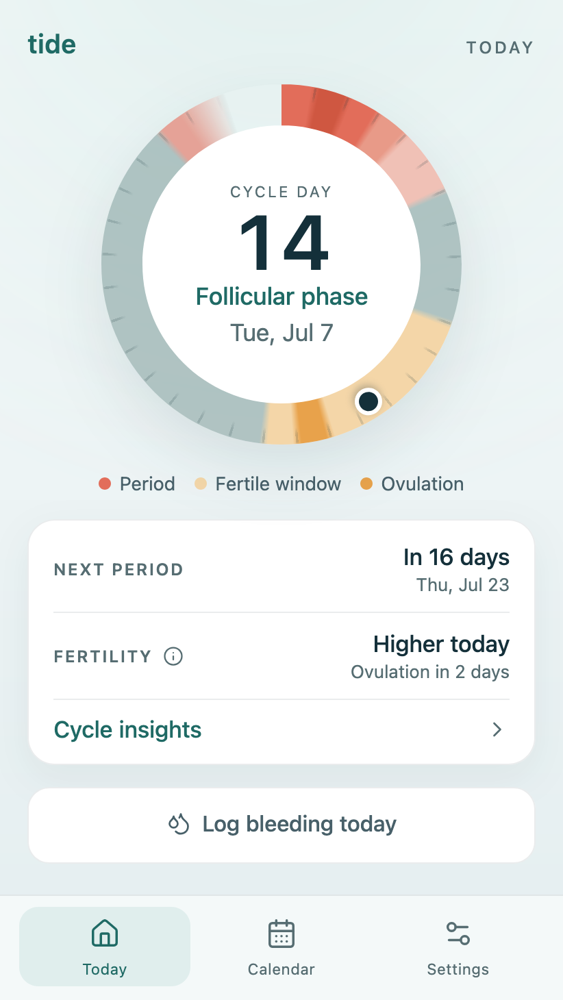
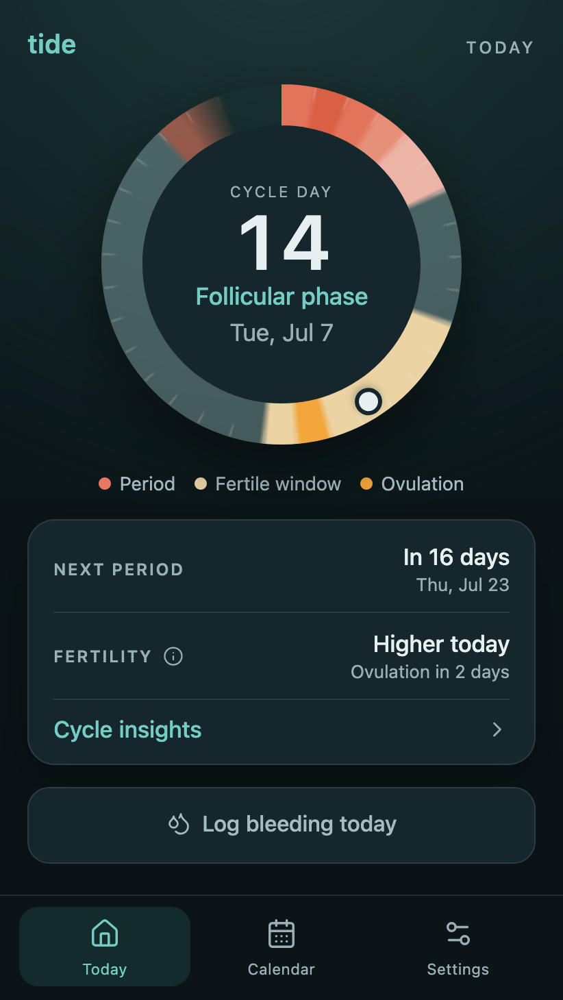
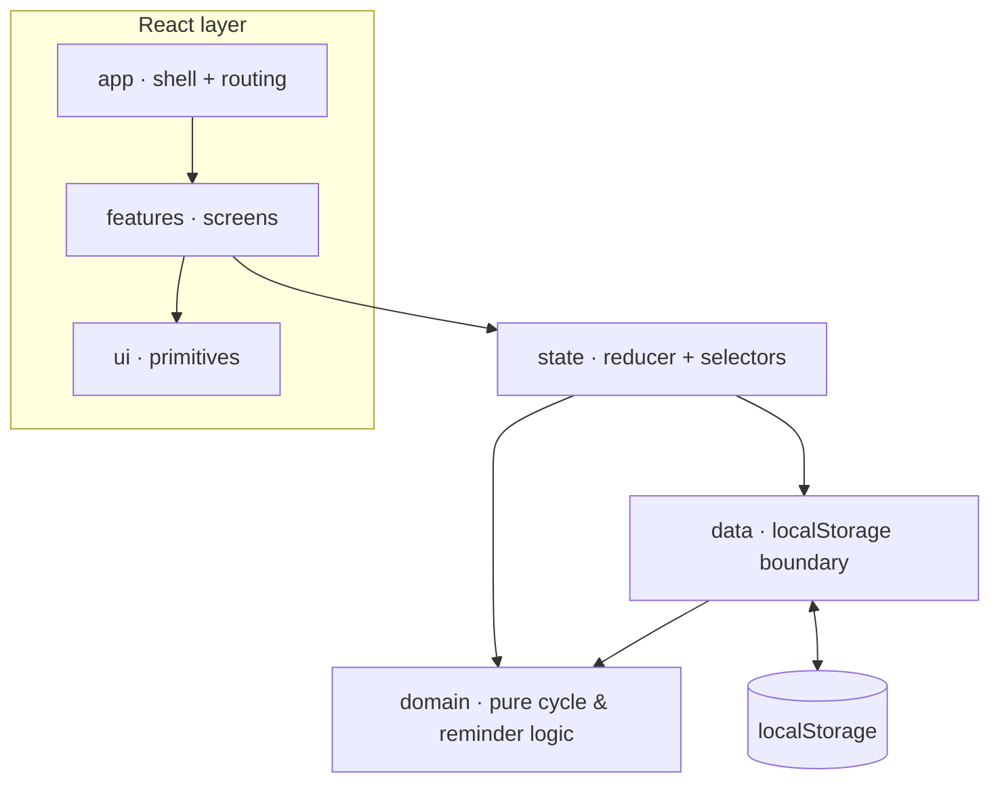

# Tide

[](https://github.com/simonvanlierde/tide/actions/workflows/ci.yml)
[](https://codecov.io/gh/simonvanlierde/tide)
[](https://tide.duinlab.nl)
[](LICENSE)
[](https://tide.duinlab.nl)

Tide is a privacy-first period tracker — a small, local-first React PWA that keeps all cycle data in your browser.

> **Status:** work in progress. Core tracking is implemented, tested, and live.

<p align="center">
  
  &nbsp;&nbsp;
  
</p>

## Install

Tide runs in the browser and installs as an app — no app store needed.

1. Open **[tide.duinlab.nl](https://tide.duinlab.nl)**.
2. Add it to your home screen:
   - **iOS (Safari):** Share → *Add to Home Screen*
   - **Android (Chrome):** menu (⋮) → *Install app*
   - **Desktop (Chrome/Edge):** install icon in the address bar

Once installed it works offline, and all data stays on your device.

## Features

- **Log bleeding days**: add or remove with one tap
- **Today at a glance**: a tidal cycle dial showing your current day and phase (menstrual / follicular / ovulation / luteal), with key cycle dates and a scrub preview
- **Predictions**: next period learned from your history (28-day fallback), plus an approximate fertile window and ovulation estimate
- **Log reminders**: a one-tap prompt in the days around your predicted period
- **Calendar**: month-by-month view with per-day period numbers and ovulation / next-period markers, for reviewing and logging days
- **Private by design**: installable, offline-capable PWA; all data stays on the device: no accounts, no network, no analytics

## Roadmap

- Improved onboarding UI / UX
- Multi-language support

## Development

Requires Node 26 and pnpm 11.

```bash
pnpm install
pnpm dev
```

| Command | Description |
| --- | --- |
| `pnpm check` | Typecheck, lint, tests, build, and bundle-size budget — the CI gate |
| `pnpm test` | Unit and UI tests |
| `pnpm test:e2e` | Playwright smoke tests |
| `pnpm build` | Production build to `dist/` |

### Accessibility

Two automated checks run against the UI. Neither certifies a conformance level (e.g. WCAG AA) — they catch the subset of issues these tools can detect automatically.

- **Static lint:** Biome's `a11y` rules are enabled (`biome.json`), so accessibility lints run as part of `pnpm lint` / `pnpm check` — on every pull request and push in CI.
- **Runtime axe checks:** `tests/e2e/a11y.spec.ts` runs [axe-core](https://github.com/dequelabs/axe-core) (via `@axe-core/playwright`) against `/`, `/history`, and `/settings`, in both light and dark themes and with the page's overlays open (info popover, calendar flow picker), tagged `wcag2a` + `wcag2aa`, and fails on any *moderate*, *serious*, or *critical* violation. Run it with `pnpm test:e2e`. In CI it runs on every pull request (the `a11y-e2e` job) and, as part of the full smoke suite, on pushes to `main`.

## Architecture

Cycle logic is kept pure and isolated from React and the browser, so it can be tested as plain functions. Dependencies point inward — the React layer reads through `state`, which is the only caller of the pure `domain` and the `data` persistence boundary:



- `src/domain` — pure cycle and reminder logic (no React, storage, or browser APIs)
- `src/data` — defaults, validation, and normalization at the `localStorage` boundary
- `src/state` — reducer and selectors, separate from the React provider
- `src/app` — app shell and pathname-based routing (`/`, `/history`, `/settings`)
- `src/features` — screen components and presentation helpers
- `src/ui` — reusable UI primitives
- `src/styles` — design tokens and shared styling
- `src/utils` — shared date helpers

Tests mirror this layering, with a thin Playwright e2e layer covering routing, persistence across reloads, and PWA smoke.

The core design decision — keeping all data on-device with no backend — is recorded in [docs/adr/0001-local-first-no-backend.md](docs/adr/0001-local-first-no-backend.md). Releases are tracked in [CHANGELOG.md](CHANGELOG.md).

## Deployment

`pnpm build` outputs a static site to `dist/`, deployable to any static host.
